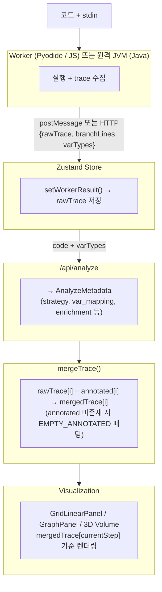

# Frogger 아키텍처 개요

## 한줄 요약

브라우저에서 코드를 실행 → trace 수집 → AI가 분석 → 시각화 렌더링하는 3단계 파이프라인.

## 전체 데이터 흐름

## 모듈 경계 요약

| 경계                | 입력                                     | 출력                | 파일                                                    |
| ------------------- | ---------------------------------------- | ------------------- | ------------------------------------------------------- |
| Worker → Store      | postMessage (Python/JS) 또는 HTTP (Java) | `WorkerDonePayload` | runtime.ts, \*.worker.js, /api/java/execute/route.ts    |
| Store → Analyze API | code + varTypes + language               | `AnalyzeMetadata`   | /api/analyze/route.ts + \_lib/                          |
| Merge               | raw + annotated                          | `MergedTraceStep[]` | trace/merge.ts                                          |
| Store → UI          | mergedTrace[step]                        | 렌더링              | \*Panel.tsx, specialViews/, graphHelpers.tsx            |
| 실행 파이프라인     | language, codeRef                        | runtimeRef          | src/hooks/useProvaExecution.ts                          |
| 재생/내비게이션     | playback state                           | —                   | src/hooks/usePlaybackTimer.ts, useKeyboardNavigation.ts |
| 패널 드래그         | setter                                   | ref 5개             | src/hooks/useDragResize.ts                              |

## 핵심 제약

- 실행 timeout: 120초 (`provaRuntime.executionTimeoutMs`)
- trace step 상한: 10,000 (`provaRuntime.maxTraceSteps`)
- 직렬화 깊이: 3단계, 컬렉션 크기 제한 (root: 30, nested: 128)
- AI 프로바이더 폴백: 메인 → 폴백 (env 설정), 토큰 초과·일시 에러 시 자동 전환
