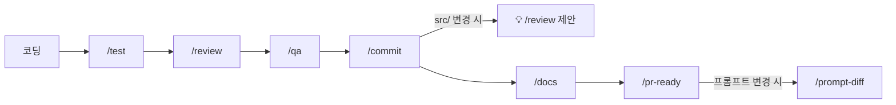
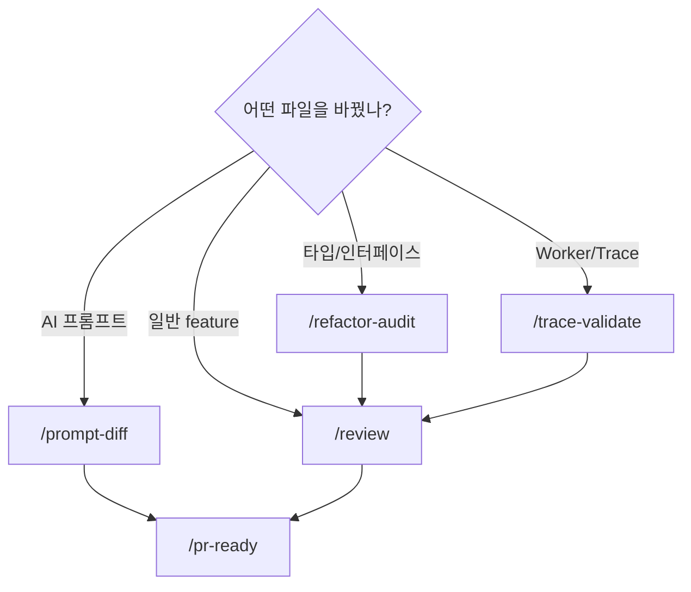
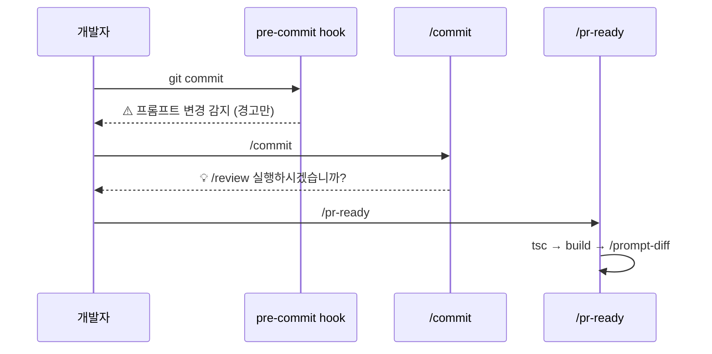

# Claude Code 커맨드 가이드

바이브코딩 워크플로우에서 사용하는 슬래시 커맨드 목록과 흐름을 정리한다.

## 커맨드 요약

| 커맨드            | 역할                                |  코드 수정   | 커밋 |
| ----------------- | ----------------------------------- | :----------: | :--: |
| `/commit`         | 변경 분석 + 커밋 메시지 생성 + 커밋 |      X       |  O   |
| `/test`           | Feature별 테스트 작성               | O (테스트만) |  O   |
| `/review`         | 코드 품질 검사 + 리팩토링           |      O       |  O   |
| `/qa`             | Feature별 QA 체크리스트 생성/업데이트 | O (문서만) |  X   |
| `/docs`           | 문서/주석/JSDoc 업데이트            |  O (문서만)  |  O   |
| `/pr-ready`       | PR 전 최종 검증 + PR Body 생성      |      X       |  X   |
| `/prompt-diff`    | AI 프롬프트 계약 회귀 검증          |      X       |  X   |
| `/refactor-audit` | Export 타입/시그니처 호환성 검증    |      X       |  X   |
| `/trace-validate` | Trace 스키마 + 병합 무결성 검증     |      X       |  X   |

## 개발 플로우

일반적인 feature 개발 시 커맨드 사용 순서:

## 상황별 검증 커맨드

변경한 파일의 종류에 따라 실행할 검증 커맨드가 달라진다:

## 자동 트리거 관계

커맨드 간 자동 연결과 pre-commit hook의 동작:

## 커맨드 상세

### 📌 /commit

변경 사항을 분석하여 conventional commit 형식의 메시지를 생성하고 커밋한다.  
`src/` 하위 feature 파일이 변경된 경우 커밋 후 `/review` 실행을 제안한다.

### 📌 /test `<feature>`

지정 feature의 테스트를 작성한다. happy path, 에러, 경계값, 빈 상태를 커버한다.  
소스 코드는 수정하지 않는다.

### 📌 /review `<feature>`

feature 소스 + 테스트의 품질을 검사하고 리팩토링한다.  
타입 안전성, 에러 핸들링, 코드 구조, 네이밍, 테스트 품질을 점검한다.
동작 변경 없이 품질만 개선한다.

### 📌 /qa `[feature]`

지정 feature의 코드를 분석하여 사용자 관점의 QA 체크리스트를 `docs/qa/{feature}.md`에 생성/업데이트한다.  
정상 동작, 엣지 케이스, 에러 케이스, UI 상태 4개 카테고리로 분류한다.  
기존 체크 상태(`[x]`)는 업데이트 시에도 유지된다. 인자 생략 시 변경된 feature를 자동 감지한다.

### 📌 /docs `[영역]`

변경된 코드 기반으로 아키텍처 문서, JSDoc, API 주석을 업데이트한다.  
변경된 코드 기반으로 아키텍처 문서, JSDoc, API 주석을 업데이트한다.

### 📌 /pr-ready `[base]`

PR 제출 전 최종 검증. 순차로 tsc → build → prompt-diff를 실행한다.  
모든 게이트 통과 시 PR Body를 생성한다. 코드를 수정하지 않는다.

### 📌 /prompt-diff `[endpoint]`

`/api/analyze`의 프롬프트 변경 후 계약 조건(필수 필드, enum 값, 타입 호환성)이 유지되는지 검증한다.

### 📌 /refactor-audit `[범위]`

리팩토링 전후로 `prova.ts` 타입 → Store → API → Worker → Visualization 경계의 호환성을 추적한다.

### 📌 /trace-validate `[범위]`

Worker → Store → AI → Renderer 경로에서 trace 데이터의 스키마 일치, varTypes 정합성, 병합 무결성을 검증한다.
