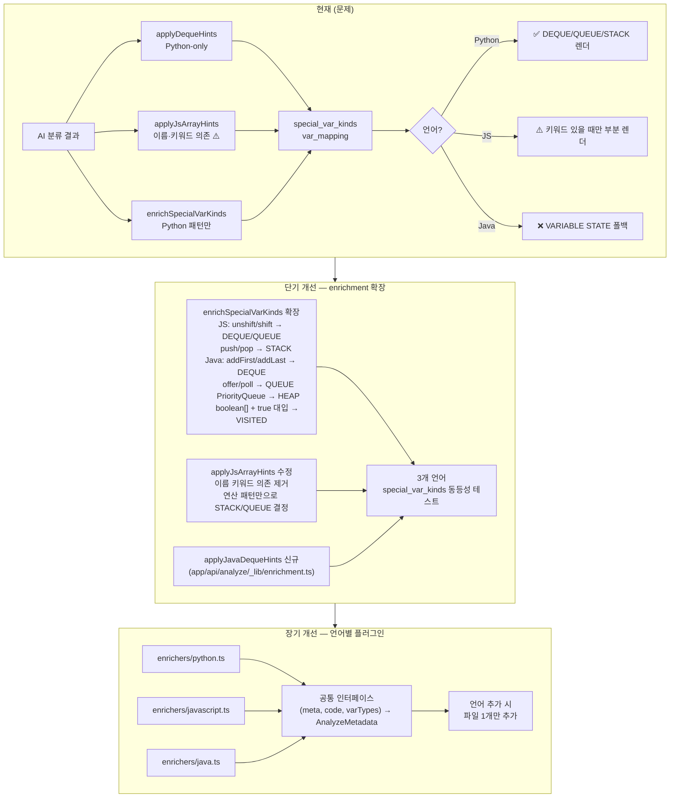

# 언어 간 렌더링 동등성 — 현황 및 갭 분석

## 목표

Python·JavaScript·Java로 작성된 **동일 알고리즘·자료구조 코드**는 동일한 시각화 전략과 패널을 사용해야 함.

---

## 파이프라인 요약

```
실행 → varTypes 수집
→ /api/analyze (AI 분류 + 후처리 enrichment)
→ strategy / var_mapping / special_var_kinds 결정
→ 렌더러 (GraphPanel / GridLinearPanel)
```

렌더링 차이는 100% **후처리 enrichment 단계**에서 발생.  
AI 응답 자체가 아닌, AI 응답을 보정하는 코드가 언어별로 불균등.

---

## 현재 언어별 후처리 적용 현황

| 함수 | Python | JS | Java |
|------|--------|-----|------|
| `applyDequeHints` | ✅ `deque()` 패턴 감지 | ✅ (연쇄 적용, 실효 없음) | ✅ (연쇄 적용, 실효 없음) |
| `applyJsArrayHints` | ❌ | ✅ (부분적) | ❌ |
| `enrichSpecialVarKinds` | ✅ Python 패턴 전용 | ✅ (실효 없음) | ✅ (실효 없음) |
| Java 전용 enrichment | ❌ | ❌ | **없음** |

---

## 루트 원인

### 1. `detectDequeVars` — Python 전용 감지

```ts
// enrichment.ts:14
line.match(/\b([A-Za-z_][A-Za-z0-9_]*)\s*=\s*deque\s*\(/)
```

Java `new ArrayDeque<>()`, JS `= []` (deque로 쓰이는 배열) 미감지 → `applyDequeHints`가 Java·JS에서 항상 조기 반환.

### 2. `enrichSpecialVarKinds` — Python 패턴 전용

| 종류 | 감지 패턴 | Python | JS | Java |
|------|----------|--------|-----|------|
| QUEUE | `deque()` + `.popleft()` | ✅ | ❌ | ❌ |
| STACK | `.append()` + `.pop()` | ✅ | ❌ | ❌ |
| HEAP | `heapq.heappush(v, ...)` | ✅ | ❌ | ❌ |
| DEQUE | `deque()` + `.appendleft()` + `.popleft()` | ✅ | ❌ | ❌ |
| VISITED | `[False]*n` 초기화 패턴 | ✅ | ❌ | ❌ |
| DISTANCE | `[INF]*n` 초기화 패턴 | ✅ | ❌ | ❌ |

### 3. `applyJsArrayHints` — 이름·키워드 기반 (규칙 위반)

```ts
// enrichment.ts:117-120
const hasDfs = /recursive|dfs|DFS|깊이|Depth|stack/.test(code) || ...
const hasBfs = /bfs|BFS|queue|너비|breadth|level/.test(code);

// 결과: BFS 키워드 없으면 QUEUE 미등록, DFS 키워드 없으면 STACK 미등록
if (!next.var_mapping.QUEUE && hasQueueOps && hasBfs) { ... }
```

**규칙 위반 (`prova-ai-linear-visualization.mdc`):**
> "클라이언트는 변수 이름으로 역할을 추측하지 않는다. 고정 매핑 테이블 금지."  
> "이름 기반 단언 금지 — 변수명은 역할을 결정하는 근거가 되지 않는다."

`dfs`, `BFS`, `queue`, `stack` 같은 **이름·주석 키워드를 코드에서 검색해 역할을 결정**하는 것은 이 원칙의 직접적 위반.  
순수 자료구조 문제(큐 연산 자체가 목적, BFS 키워드 없음)는 항상 누락.

### 4. Java enrichment 부재

Java용 enrichment 함수 자체가 없음.  
`javaFallbackHints.ts`는 AI 폴백 메타에만 사용되며 `enrichSpecialVarKinds`와 별개.

---

## 증상별 원인 매핑

| 증상 | 원인 |
|------|------|
| Java deque → VARIABLE STATE 폴백 | Java enrichment 없음 → `special_var_kinds` 미설정 → `var_mapping` 없음 |
| JS deque → 1D 배열 시각화 | BFS 키워드 없으면 QUEUE 미등록 → LinearPanel 단순 배열 |
| Python deque → 정상 DEQUE 시각화 | `enrichSpecialVarKinds` → `special_var_kinds.d = "DEQUE"` → GraphPanel DEQUE 뷰 |

---

## 규칙 위반 목록

| 파일 | 위치 | 위반 내용 |
|------|------|----------|
| `enrichment.ts` | `applyJsArrayHints:117-120` | `dfs/DFS/stack/bfs/BFS/queue` 등 이름·키워드로 역할 결정 |
| `enrichment.ts` | `applyJsArrayHints:154,157` | STACK/QUEUE 등록을 `hasDfs`/`hasBfs` (이름 기반) 에 의존 |
| `enrichment.ts` | `detectDequeVars:14` | Python `deque(` 키워드로 자료구조 판정 (언어 편향) |

> 규칙 원문: `.cursor/rules/prova-ai-linear-visualization.mdc`  
> "역할은 오직 코드에서의 사용 패턴(usage)으로만 결정한다."  
> **허용**: 타입 사용 + 연산 패턴 (`addFirst/addLast/removeFirst` 조합 등)  
> **금지**: 변수명·주석·키워드 검색 (`dfs`, `BFS`, `queue`, `stack` 문자열 매칭)

---

## 개선 로드맵



---

## 단기 수정 상세

### `applyJsArrayHints` 수정 — 이름 기반 제거

```ts
// 현재 (위반)
const hasDfs = /recursive|dfs|DFS|stack/.test(code) || ...
if (!next.var_mapping.STACK && hasStackOps && hasDfs) { ... }

// 수정 후 (패턴 기반)
// push+pop = STACK, push+shift = QUEUE, unshift+pop/shift = DEQUE
// 키워드 없이 연산 패턴만으로 결정
if (!next.var_mapping.STACK && hasStackOps && !hasQueueOps) { ... }
if (!next.var_mapping.QUEUE && hasQueueOps && !hasStackOps) { ... }
```

### Java enrichment 추가 — 연산 패턴 기반

```ts
// app/api/analyze/_lib/enrichment.ts 에 추가

export function applyJavaCollectionHints(
  meta, code, varTypes
): AnalyzeMetadata {
  // ArrayDeque / LinkedList + 양방향 연산 → DEQUE
  // ArrayDeque + offer/poll or push/pop → QUEUE / STACK
  // PriorityQueue + offer/poll → HEAP
  // boolean[] + [i] = true 패턴 → VISITED
  // int[] + Arrays.fill(INF) + [i] 갱신 → DISTANCE
}
```

### `route.ts` 적용 순서

```ts
const withDeque    = applyDequeHints(withPartitionPivots, code, varTypes);
const withJs       = lang(language).js   ? applyJsArrayHints(...) : withDeque;
const withJava     = lang(language).java ? applyJavaCollectionHints(...) : withJs;
const guarded      = applyDirectionMapGuards(withJava, code);
```

---

## 관련 파일

| 파일 | 역할 |
|------|------|
| `app/api/analyze/_lib/enrichment.ts` | 언어 무관 후처리 함수 + 언어별 enricher 디스패처 |
| `app/api/analyze/_lib/enrichers/python.ts` | Python enricher |
| `app/api/analyze/_lib/enrichers/javascript.ts` | JS enricher |
| `app/api/analyze/_lib/enrichers/java.ts` | Java enricher |
| `app/api/analyze/route.ts` | enrichment 파이프라인 |
| `src/lib/javaFallbackHints.ts` | Java AI 폴백 패턴 (enrichment와 별도) |
| `src/features/visualization/GraphPanel.tsx` | `special_var_kinds` → DEQUE/QUEUE/STACK 렌더링 |
| `.cursor/rules/prova-ai-linear-visualization.mdc` | 이름 기반 추측 금지 원칙 |

---

## 구현 완료 보고 (2026-04-12)

### 변경 요약

장기 개선 로드맵(언어별 플러그인)을 단기를 건너뛰고 바로 적용했다.

#### 신규 파일

| 파일 | 내용 |
|------|------|
| `_lib/enrichers/python.ts` | 구 `applyDequeHints` + `enrichSpecialVarKinds` Python 패턴 통합 |
| `_lib/enrichers/javascript.ts` | 구 `applyJsArrayHints` 완전 재작성 — 키워드 의존 제거 |
| `_lib/enrichers/java.ts` | 신규 Java enricher |

#### 수정 파일

| 파일 | 변경 내용 |
|------|----------|
| `enrichment.ts` | `applyDequeHints`, `applyJsArrayHints`, `enrichSpecialVarKinds` 제거 → `applyLanguageEnricher` 디스패처 추가 |
| `route.ts` | 파이프라인 5단계 → 3단계로 단순화 |
| `_lib/index.ts` | 구 함수 export 제거, `applyLanguageEnricher` export 추가 |
| `__tests__/enrichment.test.ts` | 테스트를 새 API + 새 동작에 맞게 전면 재작성 |

### 파이프라인 변경

```
// 이전
applyDequeHints → applyJsArrayHints(JS only) → applyDirectionMapGuards
→ applyGraphModeInference → enrichSpecialVarKinds → enrichLinearPivots

// 이후
applyLanguageEnricher(언어별) → applyDirectionMapGuards
→ applyGraphModeInference → enrichLinearPivots
```

### 규칙 위반 해소

| 위반 항목 | 상태 |
|----------|------|
| `hasDfs = /dfs\|DFS\|stack/.test(code)` | ✅ 제거 |
| `hasBfs = /bfs\|BFS\|queue/.test(code)` | ✅ 제거 |
| STACK/QUEUE 등록을 `hasDfs`/`hasBfs`에 의존 | ✅ 연산 패턴(`push+pop`, `push+shift`)으로 대체 |

### 언어별 enrichment 동등성 현황 (수정 후)

| 함수 | Python | JS | Java |
|------|--------|-----|------|
| HEAP 감지 | ✅ `heapq.heappush` | — | ✅ `PriorityQueue + offer/poll` |
| QUEUE 감지 | ✅ `deque + popleft` | ✅ `push+shift` (키워드 없이) | ✅ `ArrayDeque + offer/poll` |
| STACK 감지 | ✅ `list + append+pop` | ✅ `push+pop` (키워드 없이) | ✅ `ArrayDeque/Stack + push+pop` |
| DEQUE 감지 | ✅ `deque + appendleft` | ✅ `push+pop+unshift+shift` | ✅ `addFirst+addLast 조합` |
| VISITED 감지 | ✅ `[False]*n + [i]=True` | — | ✅ `boolean[] + [i]=true` |
| DISTANCE 감지 | ✅ `[INF]*n` | — | ✅ `int[] + Arrays.fill + [i]=` |
| UNIONFIND 감지 | ✅ 경로 압축 패턴 | — | — |

### TypeScript 검증

이번 변경으로 인한 신규 TS 에러: **0개**  
기존 pre-existing 에러(vitest 미설치, `icons.test.tsx` 암묵적 any)는 이번 변경과 무관.
