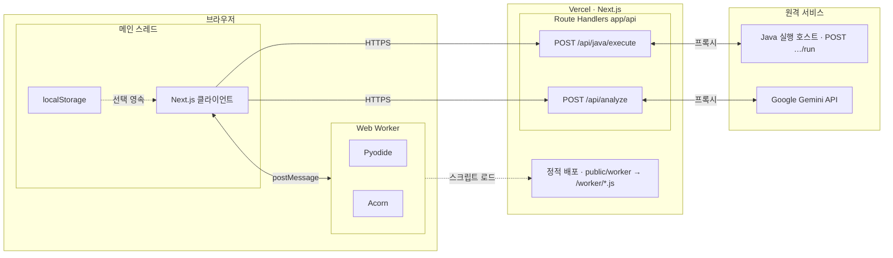

# Frogger / Prova — 배포·실행 아키텍처

- 세션 상태는 **Zustand**, 일부 설정·분석 캐시 등은 **localStorage**(선택).
- **Java** 실행은 원격 JVM(`JAVA_EXECUTION_SERVICE_URL` … `/run`). **분석**은 브라우저가 **Next** `POST /api/analyze`만 호출하고, **Next 라우트가 Gemini에 요청·응답**한 뒤 그 결과를 **HTTP 응답으로 클라이언트에** 넘긴다(브라우저가 Gemini에 직접 붙지 않음).

아래는 **디버깅 1회** 기준이다. **한 번에 선택된 언어 경로만** 탄다. `postMessage`는 HTTP가 아니라 **메인 스레드 ↔ Web Worker** IPC다.

---

## 1. 요청·응답 흐름 (요약)

**읽는 법 (이미지와 같은 좌→중→우 배치)**

- **왼쪽 브라우저**: `localStorage`는 점선처럼 **선택적** 영속 저장. **클라이언트**와 **Web Worker**는 `postMessage`로만 연결(HTTP 아님). Py·JS 실행은 워커 안에서.
- **가운데 Vercel**: (1) **정적 배포** — 워커가 쓰는 JS를 같은 출처 URL로 제공. (2) **Route Handlers** — 브라우저가 직접 가지 않는 일만 처리: Java는 **원격 JVM으로 프록시**, 분석은 **서버에서 Gemini 호출** 후 JSON을 클라이언트에 돌려줌(브라우저↔Gemini 직통 없음).
- **오른쪽 원격**: JVM은 `JAVA_EXECUTION_SERVICE_URL` 등 **별도 호스트**(배포 예: GCP VM). Gemini는 **Google 쪽 API**.
- **Java**: 워커 없이 **클라이언트 → `ApiJ` → JVM** 만 사용. **Py·JS**: 워커 실행 후 분석만 **`ApiA`** 호출하는 흐름(캐시 시 생략 가능).

| | Python · JavaScript | Java |
|--|---------------------|------|
| 실행 위치 | 브라우저 **Web Worker** | **원격 JVM**(브라우저는 프록시 API만 호출) |
| 메인 ↔ 실행 | `postMessage` | `fetch` `POST /api/java/execute` |
| 디버깅 1회에서 Next로 가는 `fetch` 대략 | 보통 **`/api/analyze`만** | **`/api/java/execute` + `/api/analyze`** |

---

## 2. 세부 (참고)

| 항목 | 내용 |
|------|------|
| `/api/analyze` 요청 | `{ code, varTypes, language? }` |
| 응답 | `AnalyzeMetadata` (전략, `var_mapping`, `linear_pivots` 등) |

---

## 관련 코드

- 실행: `src/features/execution/runtime.ts`, `public/worker/*.worker.js`
- Java: `app/api/java/execute/route.ts`
- 분석: `app/api/analyze/route.ts`
- 병합·스토어: `src/features/trace/merge.ts`, `src/store/useProvaStore.ts`
- localStorage: `src/lib/analyzeCache.ts`, `app/page.tsx`
