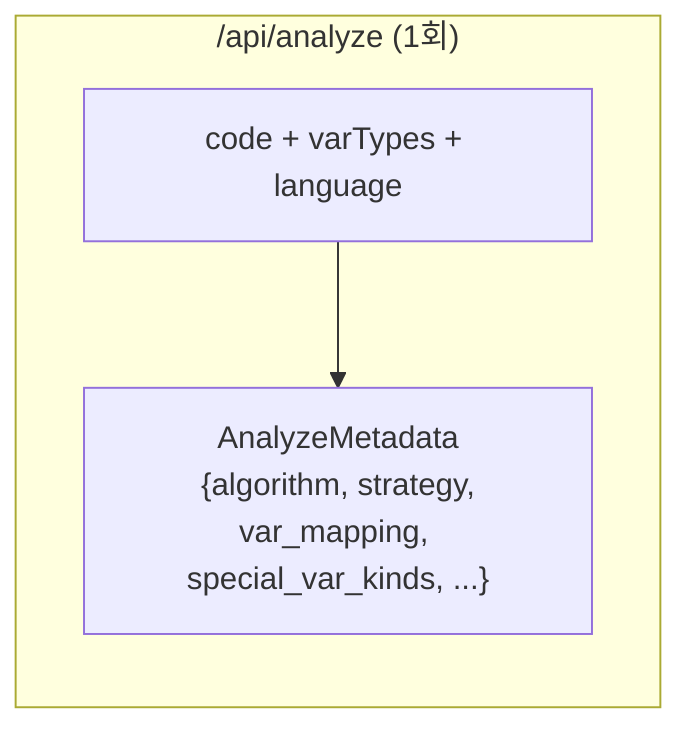
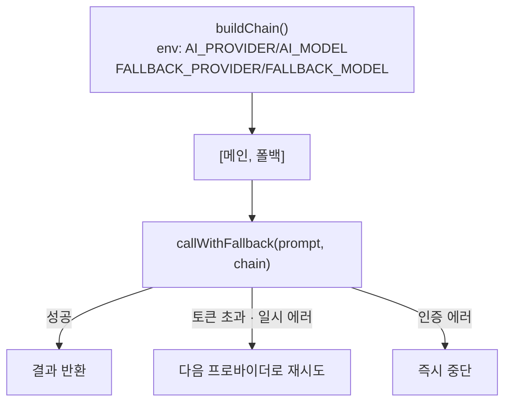

# AI Pipeline

## 한줄 요약
`/api/analyze` 1회 호출로 알고리즘 분류·전략·변수 매핑을 결정하고, 언어별 enrichment 후처리로 보강.

## 데이터 흐름



## 모듈 경계

| 엔드포인트 | 입력 | 출력 | 파일 |
|---|---|---|---|
| `/api/analyze` | `{code, varTypes, language?}` | `AnalyzeMetadata` (JSON) | app/api/analyze/route.ts |

### analyze 서브모듈 (`app/api/analyze/_lib/`)

| 파일 | 역할 |
|---|---|
| `prompt.ts` | 상수(`ANALYZE_CODE_CHAR_LIMIT`, `ANALYZE_GEMINI_SCHEMA`), `compactCodeForAnalyze`, `compactVarTypes` |
| `normalize.ts` | `normalizeResponse` (AI 응답 → `AnalyzeMetadata`), `fallbackAnalyzeMetadata`, `parseLinearPivots` |
| `enrichment.ts` | `applyLanguageEnricher` 디스패처 + `applyDirectionMapGuards` + detect 헬퍼 |
| `enrichers/python.ts` | Python enricher (deque, heapq, stack, visited, distance, unionfind 패턴) |
| `enrichers/javascript.ts` | JS enricher (push/pop, push/shift 등 연산 패턴) |
| `enrichers/java.ts` | Java enricher (PriorityQueue, ArrayDeque, boolean[] 등) |
| `partitionPivotEnrichment.ts` | 퀵소트 피벗 감지 → `pivot_mode: value_in_array` 보강 |
| `index.ts` | barrel re-export |

## AI 프로바이더 체인



**지원 프로바이더**: gemini, openai, groq, anthropic, openrouter
**파일**: `src/lib/ai-providers.ts`

## Analyze 후처리 (enrichment 파이프라인)

AI 응답 후 언어별 enricher + 공통 보강 (`_lib/enrichment.ts`, `_lib/enrichers/`):

```
enrichAnalyzeMetadataWithPartitionValuePivots → applyLanguageEnricher(언어별)
→ applyDirectionMapGuards → applyGraphModeInference → enrichLinearPivots
```

- `applyLanguageEnricher()` — 언어별 디스패처: Python/JS/Java enricher 호출 (연산 패턴 기반 HEAP/QUEUE/STACK/DEQUE/VISITED/DISTANCE/UNIONFIND 감지)
- `applyDirectionMapGuards()` — 방향 벡터 맵 var_mapping 제거
- `applyGraphModeInference()` — graph_mode 미지정 시 코드 패턴으로 추론
- `enrichLinearPivots()` — two-pointer 패턴 감지
- `enrichAnalyzeMetadataWithPartitionValuePivots()` — 퀵소트 피벗 감지 (`_lib/partitionPivotEnrichment.ts`)

## 핵심 계약 조건

- `var_mapping[].var_name` ∈ `varTypes` 키 (실제 변수명만)
- `strategy` ∈ `"GRID" | "LINEAR" | "GRID_LINEAR" | "GRAPH"`
- 에러 분석 키는 `aiError` 고정 (`runtimeError`와 구분)
- `visual_actions`에 색상/스타일 포함 금지
