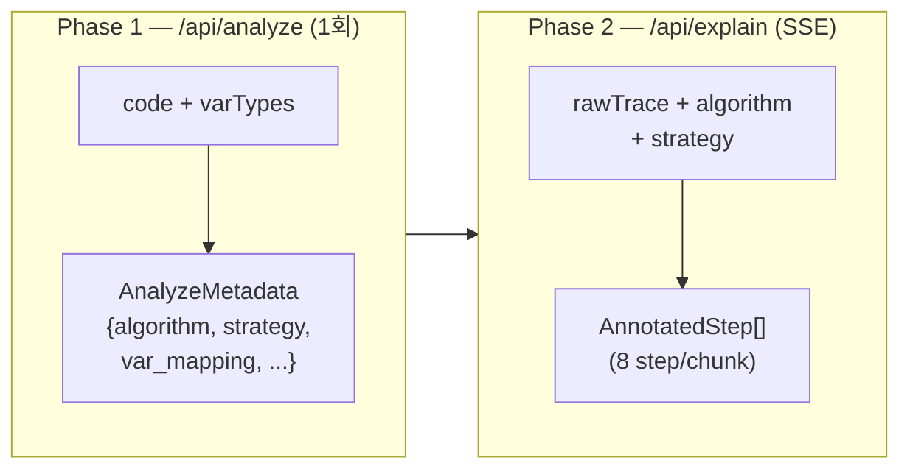
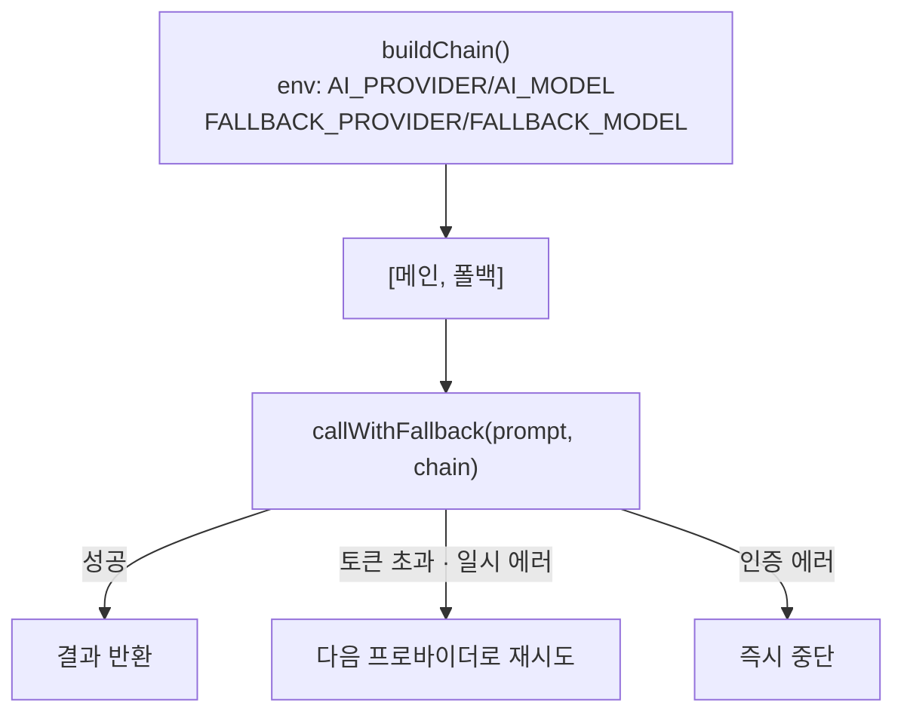

# AI Pipeline

## 한줄 요약
2-Phase AI 호출: analyze(전략·변수 매핑)→ explain(스텝별 설명·visual_actions) SSE 스트리밍.

## 데이터 흐름

## 모듈 경계

| 엔드포인트 | 입력 | 출력 | 파일 |
|---|---|---|---|
| `/api/analyze` | `{code, varTypes, language?}` | `AnalyzeMetadata` (JSON) | app/api/analyze/route.ts |
| `/api/explain` | `{rawTrace, algorithm, strategy}` | SSE stream: `{index, chunk}` | app/api/explain/route.ts |

## AI 프로바이더 체인

**지원 프로바이더**: gemini, openai, groq, anthropic, openrouter
**파일**: `src/lib/ai-providers.ts`

## Analyze 후처리 (코드 패턴 보강)

AI 응답 후 정규식 기반으로 추가 보강:
- `enrichSpecialVarKinds()` — heapq, deque, path compression, distance init, visited 패턴 감지
- `enrichLinearPivots()` — two-pointer 패턴 감지
- `applyDequeHints()`, `applyJsArrayHints()`, `applyDirectionMapGuards()`

## Explain 청크 전략

- **청크 크기**: 8 step
- **Delta 압축**: 첫 step만 전체 vars, 나머지는 변경된 값만 전송
- **SSE 이벤트**: `event: chunk` → `{index: number, chunk: AnnotatedStep[]}`, `event: done` → `{}`
- **폴백**: AI 전체 실패 시 template 설명 생성 (라인 번호 + 에러 마커만)

## 핵심 계약 조건

- `var_mapping[].var_name` ∈ `varTypes` 키 (실제 변수명만)
- `strategy` ∈ `"GRID" | "LINEAR" | "GRID_LINEAR" | "GRAPH"`
- explain 출력 배열 길이 === 입력 steps 길이 (1:1 대응)
- 에러 분석 키는 `aiError` 고정 (`runtimeError`와 구분)
- `visual_actions`에 색상/스타일 포함 금지
