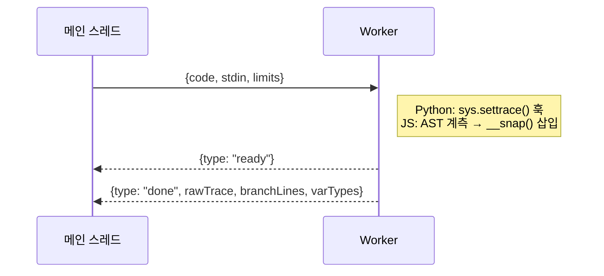
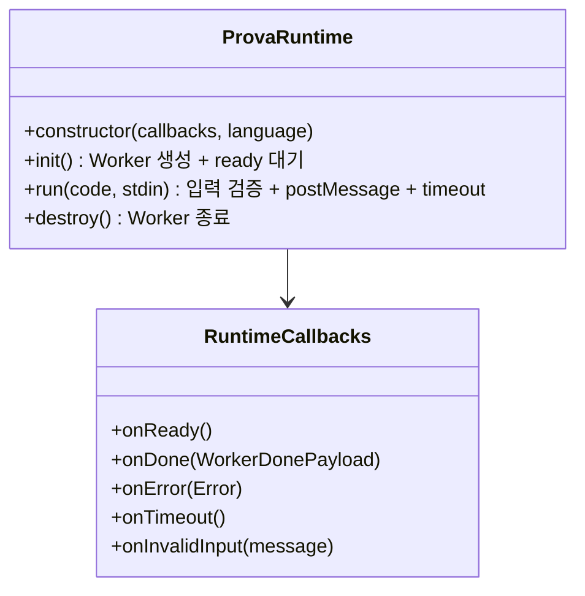

# Execution Engine

## 한줄 요약
Web Worker 기반 Python(Pyodide)/JS(Acorn 계측) 코드 실행 + trace 수집 엔진.

## 데이터 흐름

## 모듈 경계

- **입력**: `{code: string, stdin: string, limits: {maxTraceSteps, safeSerializeListLimitRoot, safeSerializeListLimitNested}}`
- **출력**: `WorkerDonePayload` = `{rawTrace: RawTraceStep[], branchLines: BranchLines, varTypes: Record<string, string>}`
- **파일**: `src/features/execution/runtime.ts`, `public/worker/pyodide.worker.js`, `public/worker/js.worker.js`

## ProvaRuntime 클래스

## Worker별 차이

| | Python (pyodide.worker.js) | JS (js.worker.js) |
|---|---|---|
| 엔진 | Pyodide v0.26.4 (WASM) | 네이티브 JS (new Function) |
| trace 방식 | `sys.settrace()` 런타임 훅 | Acorn AST 파싱 → `__snap()` 삽입 |
| 변수 접근 | `frame.f_locals` | 계측 코드에서 명시적 캡처 |
| stdin | `input()` 목킹 (줄 단위 큐) | `readline()` / `require("fs")` 목킹 |

## 핵심 제약

- timeout: 120초 (메인 스레드 setTimeout → worker.terminate())
- maxTraceSteps: 10,000 (초과 시 Python은 StepLimitExceeded 예외)
- 직렬화: 깊이 3단계, 순환참조 → `"<circular>"`, NaN/Infinity → 문자열
- 컬렉션 잘림: root 30개, nested 128개 (`"...(+N)"` 표시)
- 샌드박스: Python은 safe_builtins 화이트리스트, JS는 new Function 격리
