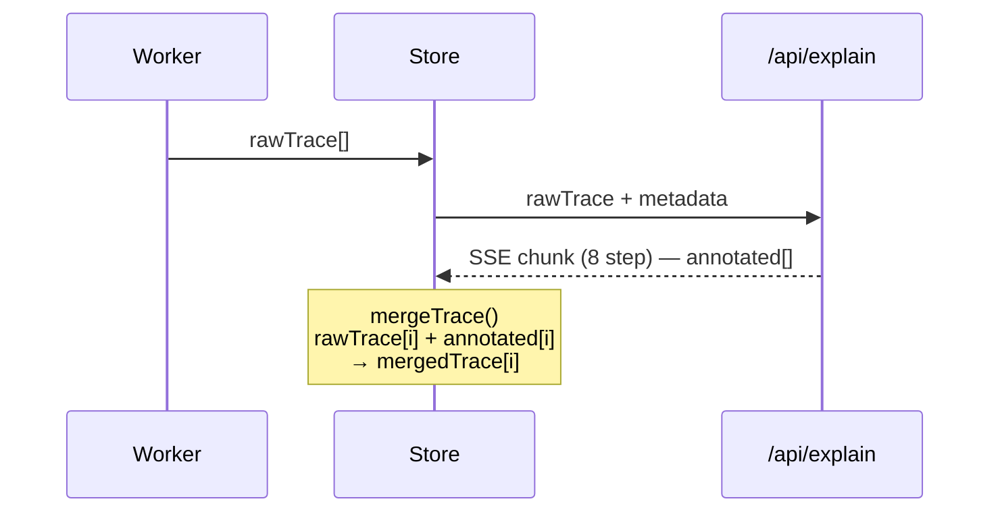

# Trace 수집 + 병합

## 한줄 요약
Worker가 수집한 rawTrace와 AI가 생성한 annotated를 1:1로 병합하여 mergedTrace를 만든다.

## 데이터 흐름



## 모듈 경계

- **입력**: `rawTrace: RawTraceStep[]`, `annotated: AnnotatedStep[]`
- **출력**: `MergedTraceStep[]` = `RawTraceStep & AnnotatedStep`
- **파일**: `src/features/trace/merge.ts`

## 핵심 타입

```typescript
RawTraceStep    = {step, line, vars, scope, parent_frames, stdout?, runtimeError?}
AnnotatedStep   = {explanation, visual_actions, aiError?}
MergedTraceStep = RawTraceStep & AnnotatedStep
```

## 병합 규칙

- `mergedTrace[i]` = `{...rawTrace[i], ...annotated[i]}`
- `annotated`가 `rawTrace`보다 짧으면 → `EMPTY_ANNOTATED`로 패딩
- `EMPTY_ANNOTATED` = `{explanation: "", visual_actions: [], aiError: null}`
- `runtimeError`(Worker 팩트)와 `aiError`(AI 해석)는 키가 달라 충돌 없이 공존

## 핵심 제약

- 병합 후 `mergedTrace.length === rawTrace.length` 보장 (패딩 포함)
- AI 청크는 순차 도착 → 도착 시마다 Store에서 re-merge
- annotated가 rawTrace보다 길면 초과분 무시