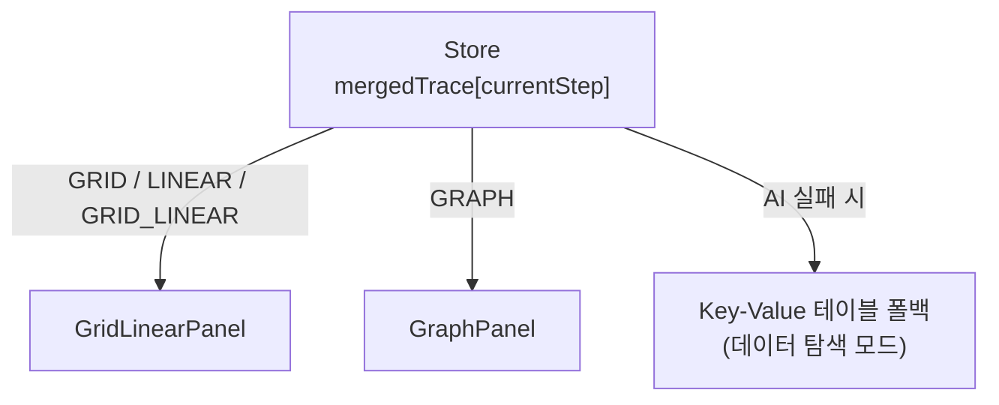

# Visualization

## 한줄 요약
AI가 결정한 전략(GRID/LINEAR/GRID_LINEAR/GRAPH)에 따라 mergedTrace를 step 단위로 렌더링.

## 데이터 흐름

## 시각화 전략별 구조

| 전략 | 컴포넌트 | 대상 데이터 | 진입 조건 |
|---|---|---|---|
| GRID | GridLinearPanel | 2D 배열 (grid, visited) | `grid[][]`, `(r,c)` 좌표 패턴 |
| LINEAR | GridLinearPanel | 1D 배열 + 포인터 인덱스 | `stack`, `queue`, `arr[]` 패턴 |
| GRID_LINEAR | GridLinearPanel | 2D + 1D 혼합 | GRID + LINEAR 동시 사용 |
| GRAPH | GraphPanel | 그래프/트리 구조 | `graph[u].append(v)` 패턴 |

## 컴포넌트 입력

**공통 props:**
- `step: MergedTraceStep | null` — 현재 스텝
- `previousStep: MergedTraceStep | null` — 이전 스텝 (변경 감지용)
- `playbackControls` — 재생/탐색 컨트롤

**GridLinearPanel 추가:**
- `linearPivots?: LinearPivotSpec[]` — 포인터 변수 매핑
- `linearContextVarNames?: string[]` — 상단 요약 스칼라 변수
- `linearArrayVarName?: string` — 1D 배열 변수명

**GraphPanel 추가:**
- `bitmaskMode?: boolean`, `bitWidth?: number` — 비트마스크 시각화

## Visual Actions (AI → 렌더러)

AI는 action 이름 + params만 반환. 색상/스타일은 렌더러 디자인 시스템이 결정.

| 패널 | 액션 |
|---|---|
| GRID | `highlight`, `focusGrid(r,c)`, `markVisited(r,c)`, `markError(r,c)` |
| LINEAR | `push(val)`, `pop()`, `updateLinear(idx,val)`, `pointer(idx,name)` |
| GRAPH | `visit(id)`, `updateGraph(id,val)`, `highlightPath(ids[])` |
| 공통 | `compare`, `swap`, `markError`, `pause` |

## 데이터 감지 로직 (GridLinearPanel)

- `getFirst2DVar()` — vars에서 첫 2D 배열 탐색
- `getFirst3DVar()` — 3D 배열 탐색
- `getFirstLinearVar()` — 1D 배열 탐색
- `getBitmaskGridAs3DVar()` — 비트마스크를 비트 배열로 확장
- `toCells()` — previousStep과 비교하여 변경된 셀 표시

## 핵심 제약

- 전역 스크롤 금지 — 모든 데이터를 Center Pane 내에서 표시
- 데이터 크기 상한: 배열 20, 그래프 노드 15 (가독성 확보)
- AI 실패 시 → `vars` Key-Value 테이블 폴백 (데이터 탐색 모드)
