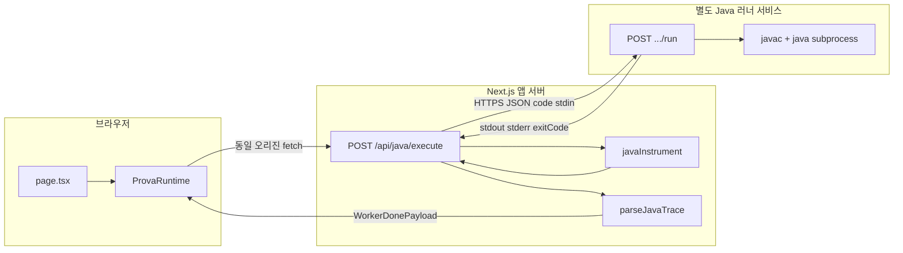

# PR: Java 실행 파이프라인 · 언어 공통화

커밋 `feat: Java 원격 실행 파이프라인 및 언어 공통화` 범위 요약

---

## 아키텍처: 브라우저 · Next · 별도 Java 러너

- **Python / JS**: 브라우저 Web Worker 내 실행
- **Java**: JVM 필요 → Prova 앱 외부 **전용 Java 실행 서버**에 위임
- **Next**: 해당 서버와 HTTP만 통신
- **`javac` / `java` 프로세스**: Java 러너 호스트에서만 실행

### 요청 흐름 단계

1. 브라우저 `ProvaRuntime` → 동일 오리진 **`POST /api/java/execute`**: 원본 코드, stdin, limits
2. Route Handler → **`JAVA_EXECUTION_SERVICE_URL` + `/run`**, `instrumentJavaCode` 적용 code
3. Java 서버 → 컴파일·실행 결과 **`{ stdout, stderr, exitCode }` JSON**
4. Next → stderr 트레이스 라인 `parseJavaTrace` → **`WorkerDonePayload`**, 이후 merge·시각화 파이프라인과 동일 형식

### 환경 변수 (`env.example` 동일 스키마)

| 변수 | 필수 | 내용 |
|------|------|------|
| `JAVA_EXECUTION_SERVICE_URL` | O | Java 러너 **베이스 URL** (끝 `/` 무관, 코드에서 `.../run` 접미) |
| `JAVA_EXECUTION_SERVICE_TOKEN` | X | 설정 시 **Next → Java 서버** 요청 헤더 `Authorization: Bearer` (러너 측 토큰 검증용) |

- **로컬 / 스테이징**: 러너 URL — 내부망 또는 `localhost`
- **프로덕션**: 방화벽·VPN·강 인증 전제
- **상세 계약**: [`docs/features/java-execution.md`](features/java-execution.md)

---

## 포함 범위

- **`POST /api/java/execute`**: `javaInstrument` 계측 → `JAVA_EXECUTION_SERVICE_URL`의 `/run` → stdout/stderr 기반 `javaTraceParser` trace 병합
- **`ProvaRuntime`**: `lang().java` 시 Worker 미사용, `fetch("/api/java/execute")`, `AbortController`·타임아웃
- **언어 공통화**: `SupportedLanguage`, `lang()`, `languageDisplayLabel`, `detectLanguageFromCode`(java), `highlightJavaLine`, `traceSanitize`·`collectUserDeclaredSymbols`(java), `DebugCodeEditor`·`page` 연동
- **`/api/analyze`**: `switch` 기반 `langSpecificHints`(Java 분기), `normalize`의 `detectJavaPatterns` 폴백
- **`env.example`**, **`docs/features/java-execution.md`**, `ai-providers` 주석 보강

## 후속 PR 대상 (이번 범위 제외)

- `GridLinearPanel` 격자 UI 스케일·스크롤
- `public/worker/pyodide.worker.js` `post_exec` / stdout 정렬
- `src/types/prova.ts` `event: post_exec`
- `.cursor/rules/prova-ai-linear-visualization.mdc` 대규모 갱신
- `docs/code-quality.md`, `mocks/PR.md`, 확장 프롬프트 초안
